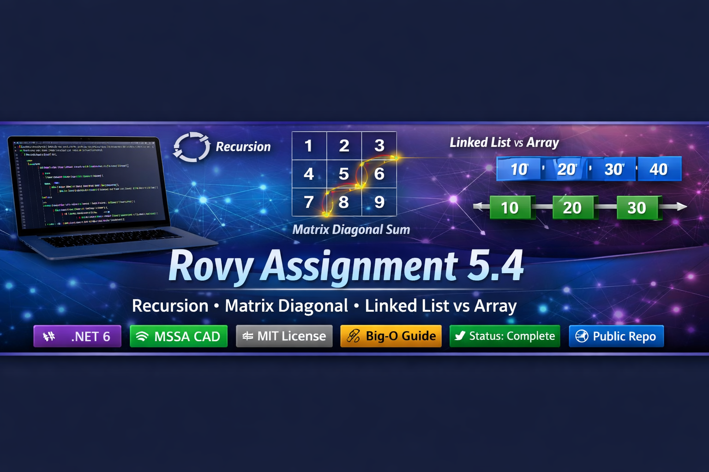

# Rovy Assignment 5.4  
Recursion • Matrix Diagonal Sum • Linked List vs Array Analysis

## 👤 Author  
**Bobby Rovy**  
U.S. Army Veteran | Software & Cloud Development (MSSA CAD)

---

# 📘 Overview  
This assignment contains **three major components**:

1. **Recursion Problem**  
   Display the individual digits of a number using recursion.

2. **Matrix Problem**  
   Compute the sum of the **right diagonal** of a square matrix.

3. **Data Structures Study Section**  
   Advantages of Linked Lists over Arrays  
   + Big‑O cheat sheet  
   + C# Linked List implementation  
   + Diagrams and explanations

This README is designed to be **recruiter‑ready**, **instructor‑ready**, and **portfolio‑ready**.

---

# 🧠 Problem 1 — Display Digits Using Recursion

### ✔ Description  
Given a number, print each digit **from left to right** using recursion.

### ✔ Example  
Input:  
`1234`  

Output:  
`1 2 3 4`

### ✔ Logic Breakdown  
1. Base case: If `n < 10`, print the digit.  
2. Recursive case:  
   - Call `PrintDigits(n / 10)`  
   - Print `n % 10`  

This prints digits **in correct order** as the recursion unwinds.

### ✔ Time & Space Complexity  
- **Time:** O(d) — one call per digit  
- **Space:** O(d) — recursion stack  
This is optimal for recursive digit processing.

---

# 🧮 Problem 2 — Sum of Right Diagonal of a Matrix

### ✔ Description  
Given an `n x n` matrix, compute the sum of the **right diagonal** (secondary diagonal).

### ✔ Example  
Matrix:  
1 2
3 4

Right diagonal elements:  
- `[0,1] = 2`  
- `[1,0] = 3`  

Sum = **5**

### ✔ Logic Breakdown  
Right diagonal index pattern:  
`matrix[i, n - 1 - i]`

### ✔ Time & Space Complexity  
- **Input reading:** O(n²)  
- **Diagonal sum:** O(n)  
- **Space:** O(n²) for matrix storage  

---

# 🧩 Full C# Program (Rovy Assignment 5.4)

```csharp
using System;

namespace Rovy_Assignment_5_4
{
    internal class Program
    {
        static void Main(string[] args)
        {
            // -------------------------------
            // Problem 1: Display digits using recursion
            // -------------------------------
            Console.Write("Input any number: ");
            var inputNumber = Console.ReadLine();

            if (!int.TryParse(inputNumber, out var number))
            {
                Console.WriteLine("Invalid number input.");
                return;
            }

            Console.Write($"The digits in the number {number} are: ");
            PrintDigits(number);
            Console.WriteLine();

            // -------------------------------
            // Problem 2: Sum of right diagonal of a matrix
            // -------------------------------
            Console.Write("\nInput the size of the square matrix: ");
            var inputSize = Console.ReadLine();

            if (!int.TryParse(inputSize, out var size) || size <= 0)
            {
                Console.WriteLine("Invalid matrix size.");
                return;
            }

            var matrix = new int[size, size];

            Console.WriteLine("Input elements in the matrix:");
            for (var i = 0; i < size; i++)
            {
                for (var j = 0; j < size; j++)
                {
                    Console.Write($"element - [{i}],[{j}] : ");
                    var elementInput = Console.ReadLine();

                    if (!int.TryParse(elementInput, out var value))
                    {
                        Console.WriteLine("Invalid input. Defaulting to 0.");
                        value = 0;
                    }

                    matrix[i, j] = value;
                }
            }

            Console.WriteLine("\nThe matrix is:");
            for (var i = 0; i < size; i++)
            {
                for (var j = 0; j < size; j++)
                {
                    Console.Write(matrix[i, j] + " ");
                }
                Console.WriteLine();
            }

            var diagonalSum = 0;
            for (var i = 0; i < size; i++)
            {
                var j = size - 1 - i;
                diagonalSum += matrix[i, j];
            }

            Console.WriteLine($"\nAddition of the right diagonal elements is : {diagonalSum}");
        }

        static void PrintDigits(int n)
        {
            if (n < 10)
            {
                Console.Write(n + " ");
                return;
            }

            PrintDigits(n / 10);
            Console.Write((n % 10) + " ");
        }
    }
}
